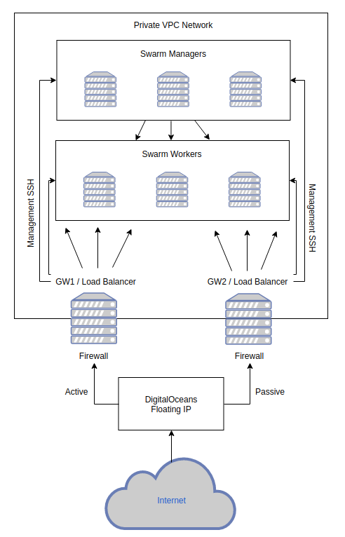

## Introduction

This is a set of Terraform configuration files and Ansible playbooks for deploying a Swarm cluster with Cassandra to DigitalOcean cloud.

## Cluster architecture

Setup has 2 active/passive gateways (keepalived) for isolated VPC network. Those hosts used as:
- Active/Passive Gateways (NAT router) for everyone inside VPC;
- Load Balancers for incoming Cassandra traffic (HAProxy)
- Secured management SSH hoppers

There is a single static DigitalOcean Floating IP pointing to the primary GW. The second GW is used as a backup and can be utilized during maintenances. Both gateways are used for outgoing connections from the cluster (each node has 2 gateways configured).

This simple setup hopefully will allow us to not have to deal with ingress controllers or external Load Balancers with lots of port forwardings.

## How to deploy

First, init, plan and apply Terraform configuration:
~~~
terraform init
terraform plan
terraform apply -auto-approve
~~~

After Terraform finishes, run all-init.yml Ansible playbook:
~~~
ansible-playbook all-init.yml
~~~

This play will create users and disable root ssh. So, from now on we should start using technical account for configuring nodes. \
\
Run all remaining Ansible plays:
~~~
ansible-playbook all-common.yml  # Runs common tasks on all nodes
ansible-playbook gw.yml  # Configures gateways
ansible-playbook swarm.yml  # Configures Swarm cluster
ansible-playbook cassandra.yml  # Deploys Cassandra cluster on the created Swarm
~~~

## To Do:

* Currently the upscaling of the cluster works great but we should do downscaling, too!

* Terraform and Ansible files should be in a separate (private) repos. That will allow us to create a pretty nifty CI/CD pipeline. One example would be:
  - After HAProxy+Swarm monitoring will see a greater increase of load, where existing nodes can't keep up, it can push refreshed Terraform config to master (i.e increased cluster size)
  - This will trigger a Terraform action (test & deploy).
  - Successful Terraform deploy will trigger an Ansible action, which will add Swarm workers to a cluster, deploy additional Cassandra nodes and add them to the GW HAProxy configuration.

* Improve security of gateways and Cassandra endpoints

* Secure all secrets. Some password-manager implementation would be great to have!
